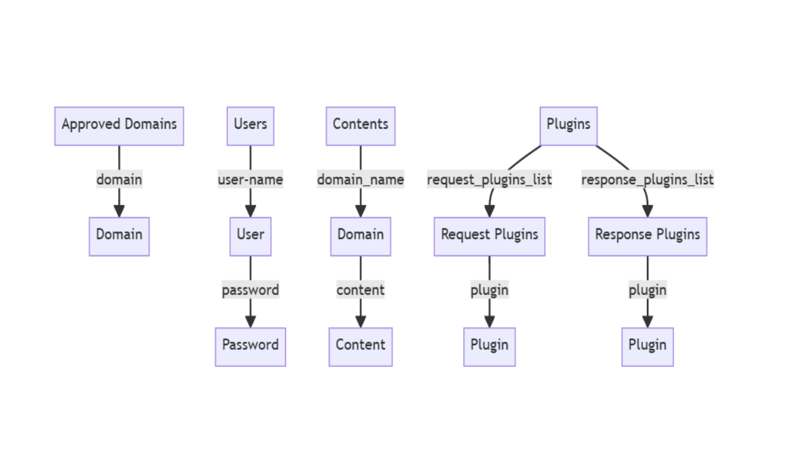

# SafeBrowse


<br>

SafeBrowse is a local content filtering system for the internet, developed as a plugin-based addon for mitmproxy. It provides organizations with control over available internet content without relying on third-party services.

## Table of Contents

1. [Project Overview](#project-overview)
2. [Key Features](#key-features)
3. [System Architecture](#system-architecture)
4. [Installation](#installation)
5. [Usage](#usage)

## Project Overview

SafeBrowse offers a unique approach to the challenge of internet content filtering by creating a local, plugin-supported system built on Python and mitmproxy. The system allows users to customize the filtering process to their specific needs and is designed for large organizations that want control over approved content without compromising information security by routing transactions through third parties.

## Key Features

- Plugin-based architecture for easy extensibility
- Local content filtering without relying on third-party services
- Customizable filtering rules
- User-friendly React-based management interface
- Support for adding and removing plugins through the UI

## System Architecture

### Plugin Structure


### User Interface Components (React)


### Data Structure (TinyDB style)



## Installation

1. Install Firefox browser.
2. Install mitmproxy:

```bash
pip install mitmproxy
```

3. Configure Firefox to use mitmproxy:

   - Open Firefox settings
   - Go to Network Settings
   - Select 'Manual proxy configuration'
   - Set HTTP Proxy to 'localhost' and Port to '8080'
   - Check 'Also use this proxy for HTTPS'

4. Install mitmproxy CA Certificate in Firefox:

   - Run mitmweb in the command line
   - Open http://mitm.it in Firefox
   - Download and install the certificate for Firefox

5. Set up the mitmproxy run script:

   - Create a file named script-test.sh in the project root
   - Add the following line:

   ```bash
   mitmweb.exe -s <directory>/runner.py --no-web-open-browser --mode regular@8080
   ```

   - Replace \<directory> with the path to the runner.py file.

## Usage

1. Run the system using the debugger in VS Code.
2. To access the system management page, enter "settings.it" in the address bar (first-time users need to register).
